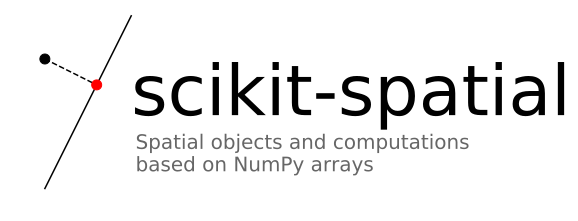

.. image:: https://img.shields.io/pypi/v/scikit-spatial.svg
         :target: https://pypi.python.org/pypi/scikit-spatial

.. image:: https://anaconda.org/conda-forge/scikit-spatial/badges/version.svg
         :target: https://anaconda.org/conda-forge/scikit-spatial

.. image:: https://img.shields.io/pypi/pyversions/scikit-spatial.svg
         :target: https://pypi.python.org/pypi/scikit-spatial

.. image:: https://github.com/ajhynes7/scikit-spatial/actions/workflows/main.yml/badge.svg
         :target: https://github.com/ajhynes7/scikit-spatial/actions/workflows/main.yml

.. image:: https://results.pre-commit.ci/badge/github/ajhynes7/scikit-spatial/master.svg
   :target: https://results.pre-commit.ci/latest/github/ajhynes7/scikit-spatial/master
   :alt: pre-commit.ci status

.. image:: https://readthedocs.org/projects/scikit-spatial/badge/?version=latest
         :target: https://scikit-spatial.readthedocs.io/en/latest/?badge=latest
         :alt: Documentation Status

.. image:: https://codecov.io/gh/ajhynes7/scikit-spatial/branch/master/graph/badge.svg
         :target: https://codecov.io/gh/ajhynes7/scikit-spatial

|

Introduction
------------

This package provides spatial objects based on NumPy arrays, as well as computations using these objects. The package includes computations for 2D, 3D, and higher-dimensional space.

The following spatial objects are provided:

   - Point
   - Points
   - Vector
   - Line
   - LineSegment
   - Plane
   - Circle
   - Sphere
   - Triangle
   - Cylinder

Most of the computations fall into the following categories:

   - Measurement
   - Comparison
   - Projection
   - Intersection
   - Fitting
   - Transformation

All spatial objects are equipped with plotting methods based on ``matplotlib``. Both 2D and 3D plotting are supported. Spatial computations can be easily visualized by plotting multiple objects at once.

Why this instead of ``scipy.spatial`` or ``sympy.geometry``?
~~~~~~~~~~~~~~~~~~~~~~~~~~~~~~~~~~~~~~~~~~~~~~~~~~~~~~~~~~~~

This package has little to no overlap with the functionality of ``scipy.spatial``. It can be viewed as an object-oriented extension.

While similar spatial objects and computations exist in the ``sympy.geometry`` module, ``scikit-spatial`` is based on NumPy rather than symbolic math. The primary objects of ``scikit-spatial`` (``Point``, ``Points``, and ``Vector``) are actually subclasses of the NumPy *ndarray*. This gives them all the regular functionality of the *ndarray*, plus additional methods from this package.

>>> from skspatial.objects import Vector

>>> vector = Vector([2, 0, 0])

Behaviour inherited from NumPy:

>>> vector.size
3
>>> vector.mean().round(3)
0.667

Additional methods from ``scikit-spatial``:

>>> vector.norm()
2.0
>>> vector.unit()
Vector([1., 0., 0.])

``Point`` and ``Vector`` are based on a 1D NumPy array, and ``Points`` is based on a 2D NumPy array, where each row represents a point in space.  The ``Line`` and ``Plane`` objects have ``Point`` and ``Vector`` objects as attributes.

Note that most methods inherited from NumPy return a regular *ndarray*, instead of the spatial object class.

>>> vector.sum()
array(2)

This is to avoid getting a spatial object with a forbidden shape, like a zero dimension ``Vector``. Trying to convert this back to a ``Vector`` causes an exception.

>>> Vector(vector.sum())
Traceback (most recent call last):
...
ValueError: The array must be 1D.

Because the computations of ``scikit-spatial`` are also based on NumPy, keyword arguments can be passed to NumPy functions. For example, a tolerance can be specified while testing for collinearity. The ``tol`` keyword is passed to ``numpy.linalg.matrix_rank``.

>>> from skspatial.objects import Points

>>> points = Points([[1, 2, 3], [4, 5, 6], [7, 8, 8]])

>>> points.are_collinear()
False
>>> points.are_collinear(tol=1)
True

Installation
------------

The package can be installed with pip.

.. code-block:: bash

   $ pip install scikit-spatial

It can also be installed with conda.

.. code-block:: bash

   $ conda install scikit-spatial -c conda-forge

Example Usage
-------------

Measurement
~~~~~~~~~~~

Measure the cosine similarity between two vectors.

>>> from skspatial.objects import Vector

>>> Vector([1, 0]).cosine_similarity([1, 1]).round(3)
0.707

Comparison
~~~~~~~~~~

Check if multiple points are collinear.

>>> from skspatial.objects import Points

>>> points = Points([[1, 2, 3, 4], [5, 6, 7, 8], [9, 10, 11, 12]])

>>> points.are_collinear()
True

Projection
~~~~~~~~~~

Project a point onto a line.

>>> from skspatial.objects import Line

>>> line = Line(point=[0, 0, 0], direction=[1, 1, 0])

>>> line.project_point([5, 6, 7])
Point([5.5, 5.5, 0. ])

Intersection
~~~~~~~~~~~~

Find the intersection of two planes.

>>> from skspatial.objects import Plane

>>> plane_a = Plane(point=[0, 0, 0], normal=[0, 0, 1])
>>> plane_b = Plane(point=[5, 16, -94], normal=[1, 0, 0])

>>> plane_a.intersect_plane(plane_b)
Line(point=Point([5., 0., 0.]), direction=Vector([0, 1, 0]))

An error is raised if the computation is undefined.

>>> plane_b = Plane(point=[0, 0, 1], normal=[0, 0, 1])

>>> plane_a.intersect_plane(plane_b)
Traceback (most recent call last):
...
ValueError: The planes must not be parallel.

Fitting
~~~~~~~

Find the plane of best fit for multiple points.

>>> points = [[0, 0, 0], [1, 0, 0], [0, 1, 0], [1, 1, 0]]

>>> Plane.best_fit(points)
Plane(point=Point([0.5, 0.5, 0. ]), normal=Vector([0., 0., 1.]))

Transformation
~~~~~~~~~~~~~~

Transform multiple points to 1D coordinates along a line.

>>> line = Line(point=[0, 0, 0], direction=[1, 2, 0])
>>> points = [[1, 2, 3], [4, 5, 6], [7, 8, 9]]

>>> line.transform_points(points).round(3)
array([ 2.236,  6.261, 10.286])

Acknowledgment
--------------

This package was created with Cookiecutter_ and the `audreyr/cookiecutter-pypackage`_ project template.

.. _Cookiecutter: https://github.com/audreyr/cookiecutter
.. _`audreyr/cookiecutter-pypackage`: https://github.com/audreyr/cookiecutter-pypackage
